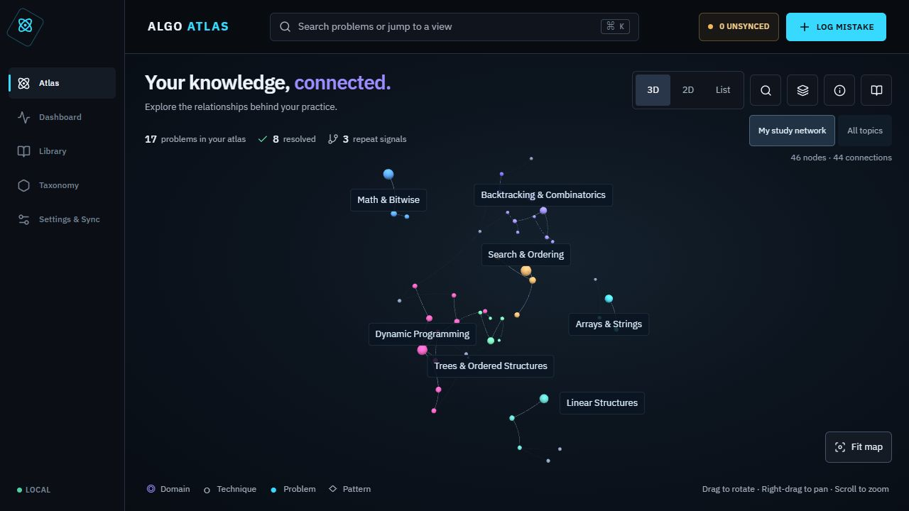

# Code Canvas

**A local-first learning system for turning coding mistakes into reusable algorithm intuition.**

Code Canvas keeps each problem's code, classification, failure reason, recognition signals, invariants, and edge cases in one place. It turns those records into a searchable library, an interactive knowledge map, visual learning labs, and diagnostics that reveal recurring weaknesses.

## What it does

Most problem trackers remember whether a problem was solved. Code Canvas remembers **why it was missed**, **what clue should trigger the right technique next time**, and **which mistakes keep repeating**.

### Core Features

- **Searchable Problem Library:** Search across titles, code, notes, techniques, and classifications to find exactly what you need to review.
- **Problem Workspace:** A focused environment for storing Python solutions, complexity analysis, and learning-structured notes (like core insights, recognition signals, and invariants).
- **Interactive Algorithm Visualizers:** Reusable step-by-step visualizations for Graph and DP problems (e.g. Steiner Tree DP, N-Queens backtracking) that connect state transitions, base conditions, and invariants directly to highlighted code tokens.
- **Pattern Diagnostics:** A dashboard that summarizes repeated signals, domain distributions, and weakness matrices to reveal failure patterns.
- **Knowledge Constellation:** An interactive 2D graph view of stored problems and taxonomy relationships to visually reveal where mistakes cluster.
- **Local-First & Private:** All data, including the FTS5 search index and rolling backups, lives locally in SQLite. The system features a reviewed sync workflow to securely publish deterministic Markdown and JSON exports to a private GitHub repository.

## What it is built on

Code Canvas is built using a modern, fast, and local-first technology stack:

- **Frontend Framework:** React 19, TypeScript, and Vite.
- **Visuals & Editing:** Monaco Editor for code, ECharts for diagnostics, and Three.js for 3D/2D interactive graph visualizations.
- **Backend API:** FastAPI and Pydantic (Python 3.11+).
- **Database & ORM:** SQLite (with WAL and FTS5 full-text search), SQLAlchemy, and Alembic for migrations.
- **Architecture & Privacy:** Local-first design. No accounts, no cloud database, and no server-side code execution.
